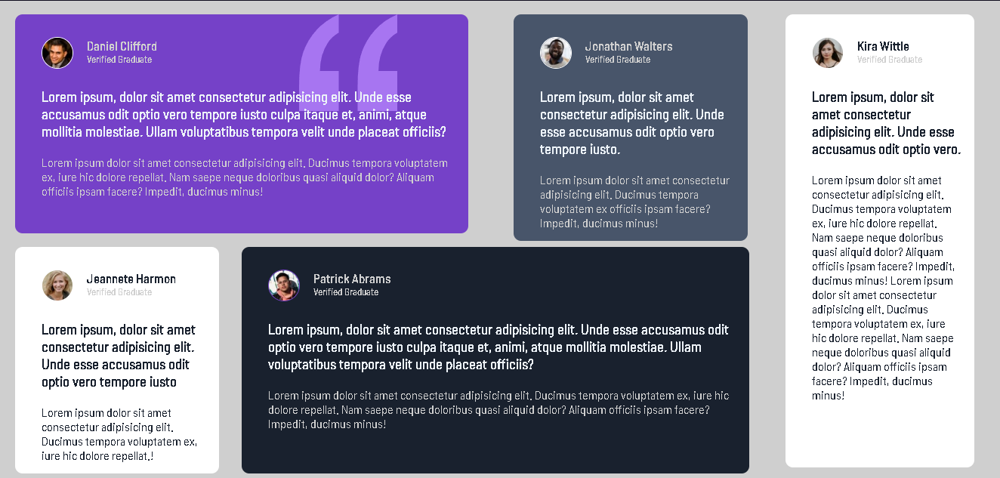
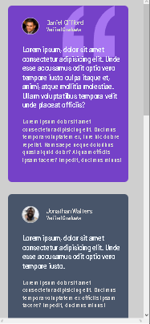
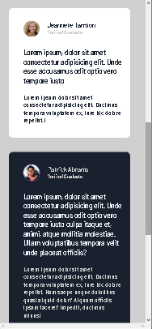
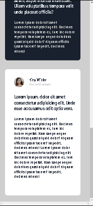

# Perguntas e Respostas 
Apesar do nome o projeto em si não é sobre isso, é mais sobre depoimentos, relevando isso esse projeto foi feito para estudo de posicionameto de elementos apenas com medidas, sem a utilização de comandos facilitadores (como display flex e grid).😉

## Versão Desktop:

[]

## Versão Celular:

[]
[]
[]

## Tecnologias utilizadas
- HTML
- CSS